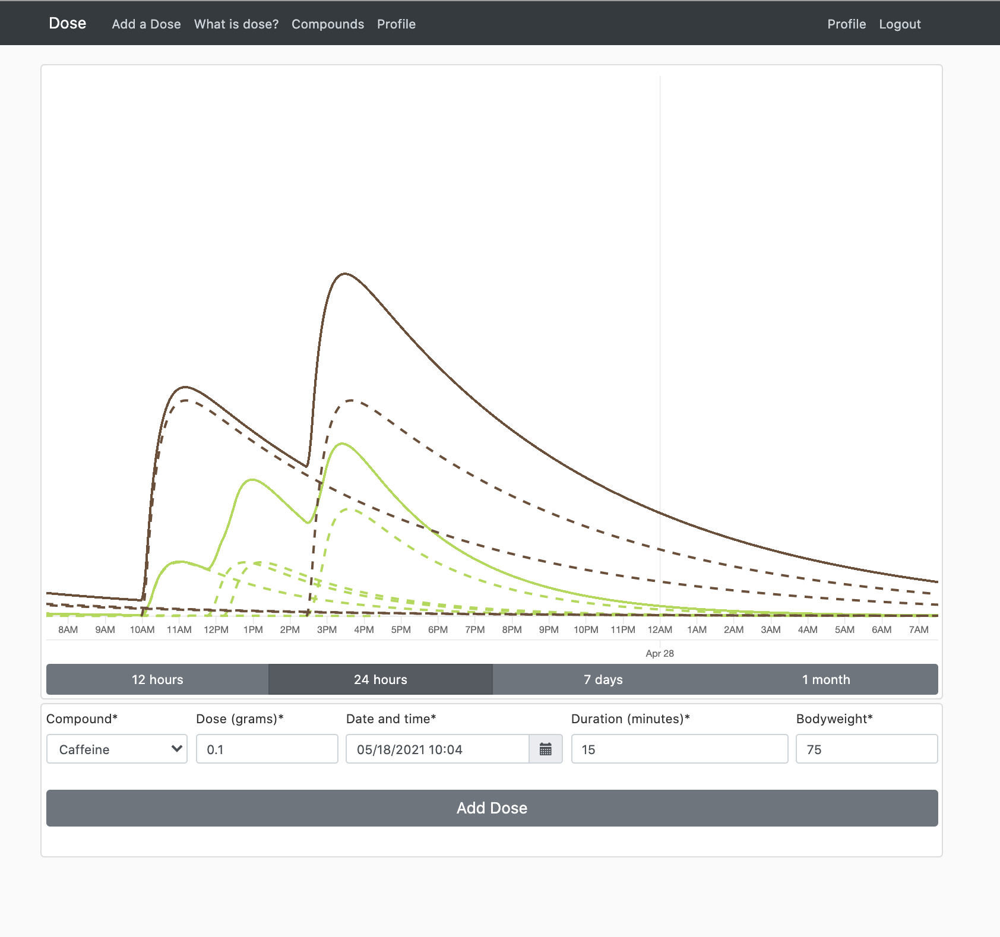

## Dose
Modelling plasma concentration for different compounds and visualizing for users.

  
  

### Goals
- Implement pharmocokinetic models into python classes
    - First order elimination
    - Enzymatic metabolism
- Implement models into django server
- Setup database 
- Visualize Plasma concentration of doses over time

### Problems
- How to stack multiple enzymatic compounds and visualize in fast way. 
    - Doses for first order kinetics compounds can be stacked up to form total concentration over time. 
    - Enzymatic metabolisation speed depends on substrate concentration 
        - need to run complete model again for each extra dose.
- LazySignup user or session?

### Work to be done
- Therapeutic margin calculation
    - Add side-effect at certain time
    - Add therapeutic effect at certain time
- Python class implementing everything
    - enzymatic metabolization
    - first-pass effect
    - different compartments
- Visualizations
    - Scroll through time -> better
    - "now" line -> first decide which plotting library to go with
        - https://stackoverflow.com/questions/30256695/chart-js-drawing-an-arbitrary-vertical-line
    - add "0" values for times not in sum compounds for every sum compounds in range of at least 1 month
- Implement user model: connect to dose so only your own doses show up.
    - automatically enter weight 
    - make profile model with weight
- Host server on digital ocean droplet using Docker
- Blog with posts about pharmacokinetics and the effect of different plasma concentration levels on brain functions ["Jerkes Dodson Law"](https://en.m.wikipedia.org/wiki/Yerkes%E2%80%93Dodson_law).
    

### Components  
- Dose model (python)
    - Python class descriptions: can be called with a dose concentration and compound parameters and gives concentration over time.
        - OneCompModel: first order kinetics
        - PietersModel: enzymatic metabolisation + renal clearance and stomach clearance
    - playground.py: off-server model testing
    - Get's fetched from github by server
- Dose server (python-django)
    - Model: dose and compound parameters and gives list of concentration over time
    - Databases
        - CompoundType
        - Compound
            - Description
            - pharmacokinetic parameters
            - structure
        - Dose
            - mass
            - time of dose
            - compound
            - user
        - PlasmaConcentration
            - time
            - concentration
            - Corresponding Dose
    - User interface
        - Enter data into forms
        - Visualize data
    - Back end: 
        - Enter new compounds by compound types
        - Generates structure images from smiles
    
- Dose app (react native)
    - user interface
    
    
    
    

